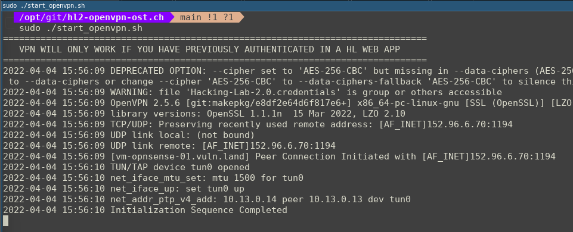
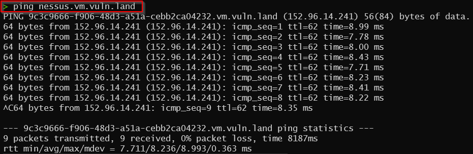

# Introduction
If you need a reverse-shell from one of the vulnerable Hacking-Lab services back to your local computer, you must connect to our vulnerable systems using OpenVPN. The vulnerable services are firewalled and therefore you cannot connect back to an internet ip address.

## Video
* https://youtu.be/naVrSd3yMN0
* https://youtu.be/cCfw_YbEAVs
* https://youtu.be/JQQv-LSU4Nk

## Pre-Requirement
Please be aware, you **MUST** be authenticated with your browser in one of the Hacking-Lab 2.0 applications, `before VPN access will be granted`!

## Usage
Please run the `start_openvpn.sh` script as `root` using the `sudo ./start_openvpn.sh` command and test your connection

You should be able to `ping` the `nessus` host, once your VPN is up an running. 

## Troubleshooting

1. `no such file or directory: /usr/sbin/openvpn`: install the openvpn client (e.g. `sudo apt install openvpn`)
2. `UDP link remote: [AF_INET]152.96.14.70:1194`: make sure you are still logged in to the hacking-lab using a browser from the same IP address
3. `ERROR: Cannot ioctl TUNSETIFF tun: Operation not permitted (errno=1)`: make sure you are running the OpenVPN client with root rights (e.g. `sudo ./start_openvpn.sh`)
4. `Options error: In [CMD-LINE]:1: Error opening configuration file: /some/path/Hacking-Lab-2.0.ovpn`: make sure to call the `start_openvpn.sh` script from the correct directory

Once you connect successfully, you should see the message `Initialization Sequence Completed`.

## Hacking-Lab Kookarai Pentesting Linux
The VPN is pre-configured on the latest Kookarai Pentesting Linux
Get a copy from https://livecd.hacking-lab.com/ 

## More Information
Please visit https://www.hacking-lab.com/ to find more information. 

