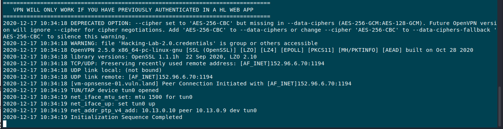

# hl2-openvpn-ost.ch

Hacking-Lab 2.0 OpenVPN Client Configuration for the OST DC in Switzerland

## Introduction

Hacking-Lab 2.0 introduces an OpenVPN gateway. This is useful when testing reverse shells from the vulnerable systems to the students computer. 

## Pre-Requirement

Please be aware, you **MUST** be authenticated with your browser in one of the Hacking-Lab 2.0 applications, `before VPN access will be granted`!

## Usage

Please run the `start_openvpn.sh` script as `root` and test your connection

## Troubleshooting

1. `no such file or directory: /usr/sbin/openvpn`: install the openvpn client (e.g. `sudo apt install openvpn`)
2. `UDP link remote: [AF_INET]152.96.6.70:1194`: make sure you are still logged in to the hacking-lab using a browser from the same IP address
3. `ERROR: Cannot ioctl TUNSETIFF tun: Operation not permitted (errno=1)`: make sure you are running the OpenVPN client with root rights (e.g. `sudo ./start_openvpn.sh`)
4. `Options error: In [CMD-LINE]:1: Error opening configuration file: /some/path/Hacking-Lab-2.0.ovpn`: make sure to call the `start_openvpn.sh` script from the correct directory

Once you connect successfully, you should see the message `Initialization Sequence Completed`.

## Hacking-Lab LiveCD

The VPN is pre-configured on the latest HL LiveCD. 
Get a copy from https://livecd.hacking-lab.com/ 

